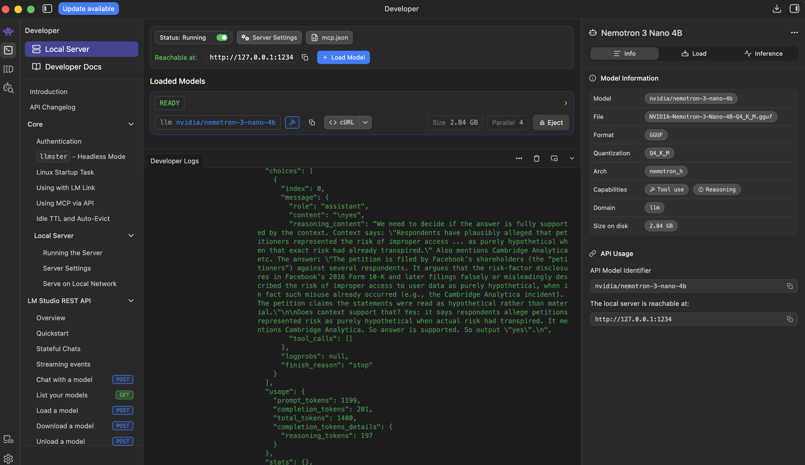

# Agentic RAG - VL

## Getting Started

This project uses a lot of external services. Which is why it's recommended to be run inside as a docker container, so that all necessary services can run as images.

### Using Docker (+Compose)

#### Step #1: Environment Variables

At first, we'd have to provide the necessary details to the project in form of an `.env` file. You can get a sample of the file in [`.env.sample`](https://github.com/Mukhopadhyay/AgenticRAG-VL/blob/main/.env.sample).

```bash
# =================================================
# LLM Provider — uncomment ONE block
# =================================================

# Groq
GROQ_API_KEY=gsk_xxx
LLM_MODEL=groq/llama-3.1-8b-instant

# OpenAI
# OPENAI_API_KEY=sk-xxx
# LLM_MODEL=openai/gpt-4o-mini

# LM Studio (local)
# LLM_API_BASE=http://host.docker.internal:1234/v1
# LLM_MODEL=openai/nvidia/nemotron-3-nano-4b
```

To make this project model agnostic, [ChatLiteLLM](https://docs.litellm.ai/docs/langchain/) have been used. So in order to select different provider, e.g., Groq / OpenAI / Local LLMs (using LM Studio), proper block must be uncommented.

If you want to use Groq, simply place the GROQ_API_KEY and the model you'll be using.

**Local LLMs**

If you're going to be using Local LLMs in that case, comment out the GROQ block and uncomment the LM Studio block,

```bash
# =================================================
# LLM Provider — uncomment ONE block
# =================================================

# Groq
# GROQ_API_KEY=gsk_xxx
# LLM_MODEL=groq/llama-3.1-8b-instant

# OpenAI
# OPENAI_API_KEY=sk-xxx
# LLM_MODEL=openai/gpt-4o-mini

# LM Studio (local)
LLM_API_BASE=http://host.docker.internal:1234/v1
LLM_MODEL=openai/nvidia/nemotron-3-nano-4b
```

Do not modify the `LLM_API_BASE` key, that is hwo we're passing the host machine's (your computer's) localhost to the docker image. Select the model from LM Studio's control panel.



#### Step #2: Starting the container

```bash
docker compose up --build
```

--- 

### Running locally

This project uses `uv` for managing it's dependencies. So it's recommended you use uv as well, for syncing the project.

#### Step #1. Installing the deps

Install the dependencies locally using
```bash
uv sync
```

#### Step #2: Prerequisites

This project depends on Qdrant & the `.env` variables. See the documentation above for .env setup. If you're running qdrant as a container
locally, then you'd have to additional set the following to values in your
`.env` file

```bash
...

# Required if using local Qdrant
QDRANT_URL=http://localhost:6333
# DATA_DIR=data/raw
```

Your full `.env` in that case (assuming you're using local LLMs as well) would look something like this

```bash
# =====================================
# LLM Provider — uncomment ONE block
# =====================================

# Groq
# GROQ_API_KEY=gsk_xxx
# LLM_MODEL=groq/llama-3.3-70b-versatile

# OpenAI
# OPENAI_API_KEY=your_openai_key_here
# LLM_MODEL=openai/gpt-4o-mini

# LM Studio (local)
LLM_API_BASE=http://host.docker.internal:1234/v1
LLM_MODEL=openai/nvidia/nemotron-3-nano-4b

# Required if using local Qdrant
QDRANT_URL=http://localhost:6333
# DATA_DIR=data/raw
```
