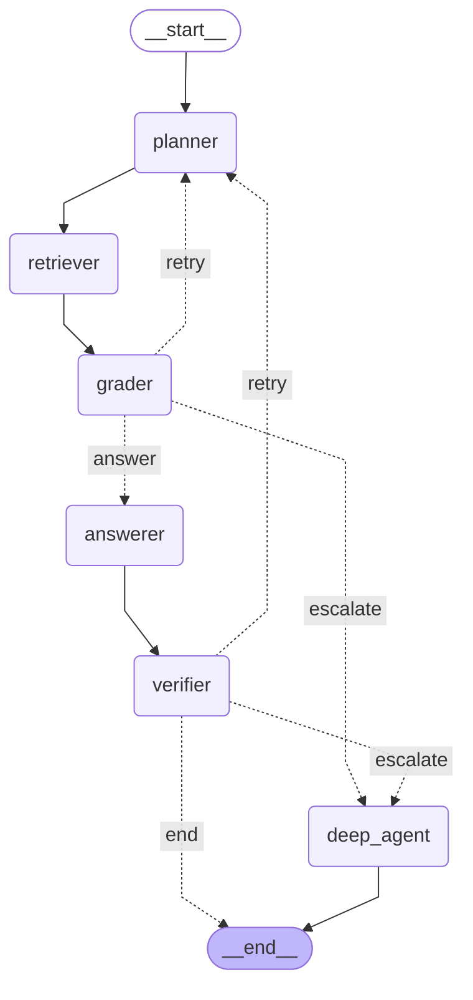
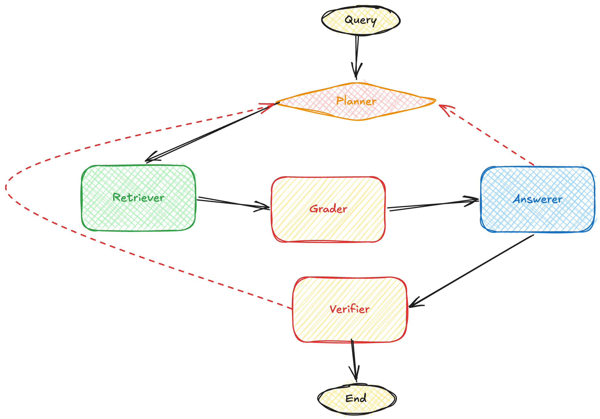

# Agentic RAG

  

This document describes the five agents that make up the agentic RAG pipeline built with LangGraph.

---

## Overview

The pipeline follows a loop

If the Grader finds no relevant documents, or the Verifier rejects the answer, the pipeline loops back to the Planner with a retry hint. After two retries the best available answer is returned.

---

## 1. Planner

**File:** `src/agents/planner.py`

The Planner rewrites the user's original query into a cleaner, more specific form that is easier to match against the vector store. On retries it receives a hint to try a different angle, so each retrieval attempt uses a slightly different phrasing.

**Input:** raw user query + retry count  
**Output:** rewritten query string

---

## 2. Retriever

**File:** `src/agents/retriever.py`

The Retriever takes the rewritten query from the Planner and fetches the most semantically similar document chunks from the Qdrant vector store using the configured embedding model and search strategy (MMR by default).

**Input:** rewritten query  
**Output:** list of raw retrieved documents

---

## 3. Grader

**File:** `src/agents/grader.py`

The Grader checks every retrieved document individually and decides whether it is actually relevant to the user's question. It uses the LLM to score each document with a simple yes/no judgement and discards anything that does not pass.

**Input:** query + list of retrieved documents  
**Output:** filtered list of relevant documents

---

## 4. Answerer

**File:** `src/agents/answerer.py`

The Answerer synthesises a final answer from the graded, relevant documents. It is instructed to answer only from the provided context and to clearly say when information is not found, preventing hallucination.

**Input:** query + filtered documents  
**Output:** answer string

---

## 5. Verifier

**File:** `src/agents/verifier.py`

The Verifier acts as a final quality gate. It reads the answer alongside the source documents and asks the LLM whether the answer is fully supported by the context. If not, it signals the graph to retry (up to the configured maximum). This guards against hallucinated or unsupported responses slipping through.

**Input:** query + filtered documents + proposed answer  
**Output:** boolean (verified / not verified)

---

<small>
<i>Just the agents</i>
</small>

## 6. DeepAgent

**File:** `src/agents/deep_agent.py`

The DeepAgent is an autonomous escalation agent built with [DeepAgents](https://pypi.org/project/deepagents/). It is triggered when the structured LangGraph retry loop has already failed once — either because the Grader found no relevant documents after a retry, or because the Verifier rejected the answer after a retry.

Unlike the fixed Planner → Retriever → Grader → Answerer chain, the DeepAgent plans its own retrieval strategy using its built-in `write_todos` planning tool, issues multiple targeted `search_documents` calls, and synthesises the final answer from all gathered evidence. It is capable of sub-agent spawning for very complex queries and manages context automatically to avoid window overflow.

**Input:** original user query  
**Output:** synthesised answer string (written directly to state; Verifier is not re-run)

---

## Graph & State

| File | Purpose |
|------|---------|
| `src/graph/state.py` | Shared `TypedDict` that flows through every node |
| `src/graph/nodes.py` | Thin node functions that call each agent |
| `src/graph/workflow.py` | LangGraph `StateGraph` wiring + conditional retry/escalation edges |

For the full routing diagram and step-by-step execution description see [workflow.md](workflow.md).

### State fields

| Field | Type | Description |
|-------|------|-------------|
| `query` | `str` | Original user question |
| `rewritten_query` | `str` | Planner's improved query |
| `retrieved_docs` | `List[Document]` | Raw docs from the vector store |
| `filtered_docs` | `List[Document]` | Relevant docs after grading |
| `answer` | `str` | Final answer from the Answerer or DeepAgent |
| `verified` | `bool` | Whether the Verifier approved the answer |
| `retry_count` | `int` | Number of retry loops completed |
| `deep_agent_used` | `bool` | Whether the DeepAgent produced the final answer |
