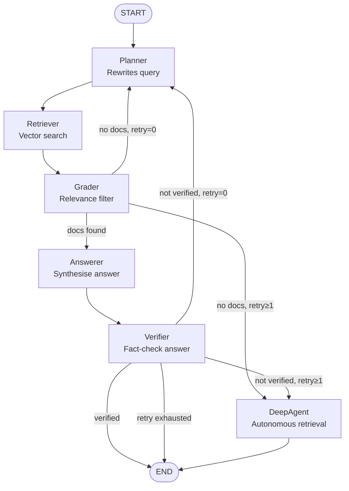

# Workflow — LangGraph & DeepAgents

This document describes the full execution flow of the Agentic RAG pipeline and how LangGraph and DeepAgents collaborate.

---

## Overview

The pipeline has two layers of orchestration:

| Layer | Technology | Responsibility |
|-------|-----------|----------------|
| **State machine** | LangGraph `StateGraph` | Owns the shared state, routes between nodes, and enforces the retry budget |
| **Autonomous agent** | DeepAgents `create_deep_agent` | Self-directed node that plans and executes multi-step retrieval when the structured loop is insufficient |

---

## LangGraph State

All nodes read from and write to a single `TypedDict` that flows through the graph:

| Field | Type | Set by |
|-------|------|--------|
| `query` | `str` | Caller |
| `rewritten_query` | `str` | Planner |
| `retrieved_docs` | `List[Document]` | Retriever |
| `filtered_docs` | `List[Document]` | Grader |
| `answer` | `str` | Answerer / DeepAgent |
| `verified` | `bool` | Verifier |
| `retry_count` | `int` | Planner |
| `deep_agent_used` | `bool` | DeepAgent node |

---

## Graph Topology



---

## Step-by-step Execution

### Happy path

```
START → Planner → Retriever → Grader → Answerer → Verifier → END
```

1. **Planner** rewrites the raw query into a retrieval-friendly form.
2. **Retriever** fetches the top-K chunks from Qdrant using MMR search.
3. **Grader** scores each chunk and discards irrelevant ones.
4. **Answerer** synthesises an answer strictly from the filtered documents.
5. **Verifier** checks the answer is grounded in the source material. If so, the graph ends.

### First-retry path (retry_count = 0 → 1)

If the Grader finds no relevant documents **or** the Verifier rejects the answer on the first pass, the graph loops back to the Planner with a retry hint. The Planner rephrases the query from a different angle and the cycle repeats.

### DeepAgent escalation path (retry_count ≥ 1)

After one failed retry the graph routes to the **DeepAgent** node instead of looping again. This avoids burning the full retry budget on the same structured approach when that approach has already been proven insufficient.

The DeepAgent:

1. Receives the **original** user query (not the rewritten one) to avoid inheriting any misdirection from the Planner.
2. Uses its built-in `write_todos` planning tool to decompose the problem into retrieval sub-tasks.
3. Calls `search_documents` — a LangChain tool backed by the project's Qdrant retriever and Grader — as many times as needed with different query phrasings.
4. Synthesises a final answer from all gathered evidence.
5. Returns the answer directly to `END`; the Verifier is not re-run to prevent infinite escalation.

---

## DeepAgents Integration Detail

### Why DeepAgents?

Standard LangGraph retry loops re-execute the same linear flow with a slightly reworded query. DeepAgents adds:

- **Planning** (`write_todos`): the agent decides *which sub-questions to ask* before searching.
- **Multi-call retrieval**: it can issue several distinct `search_documents` calls and merge the results.
- **Context management**: built-in file-system tools allow it to offload intermediate results and keep the context window from overflowing.
- **Sub-agent spawning** (built-in `task` tool): for very complex queries it can delegate sub-problems to isolated sub-agents.

### Tool exposed to the DeepAgent

```python
def search_documents(query: str) -> str:
    """Search the document collection for information relevant to a query."""
```

Internally this calls `Retriever.retrieve()` followed by `Grader.grade()`, so the DeepAgent always sees pre-filtered, relevant excerpts — not raw vector-search noise.

### Model

The DeepAgent reuses the same `BaseChatModel` instance constructed by `get_llm()` (LiteLLM-backed, with exponential-backoff rate-limit retry). No second API key or separate model configuration is required.

---

## Routing Logic (condensed)

```python
# After Grader
if docs_found:           → answerer
if not docs and retry=0: → planner   (retry hint added)
if not docs and retry≥1: → deep_agent

# After Verifier
if verified:                    → END
if retry_count >= MAX_RETRIES:  → END  (best-effort answer)
if not verified and retry=0:    → planner
if not verified and retry≥1:    → deep_agent
```

---

## Configuration

| Setting | Effect on flow |
|---------|---------------|
| `MAX_RETRIES` | Hard cap on total retry loops; prevents infinite cycles |
| `SEARCH_K` | Number of chunks the Retriever fetches per call (applies inside DeepAgent's tool too) |
| `SEARCH_TYPE` | `mmr` reduces redundancy; `similarity` maximises raw relevance |
| `VERBOSE` | Prints each agent's activity including DeepAgent answer length |
